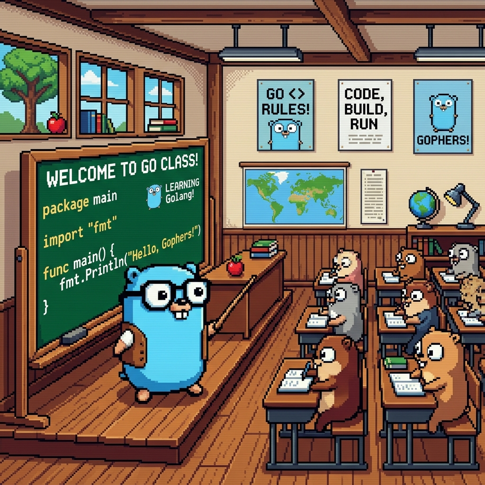

  

  # Meu repositório Go
  
  *Um espaço para aprendizado, experimentação e evolução em Go.*

---

## 📖 Sobre

Bem-vindo ao meu repositório de estudos em Go. 

Seguindo o esquema de Learning in Public, todo o meu processo de aprendizado e notas serão publicados aqui, sem muito ritual. A ideia é manter o repositório como um documento vivo, sendo o diário de uma jornada. 

## 🤖 Guias e Padrões

Este repositório é guiado por diretrizes específicas de treinamento, com foco didático. Para entender como o código é estruturado e quais são as regras de estilo adotadas, consulte o [Guia de Agentes (AGENTS.md)](./AGENTS.md).

---
*Criado com dedicação por Carlos Mello Jr.*
